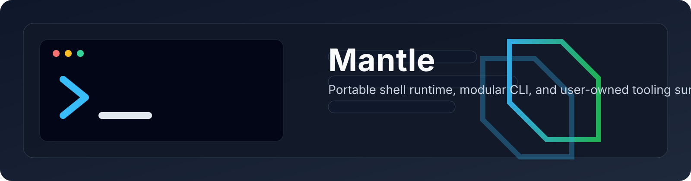

<p>
  
</p>

<h1>Mantle</h1>

<p>A portable, modular shell environment and developer-tooling framework for local-first development.</p>

<p>
  <a href="https://github.com/egohygiene/mantle/actions/workflows/test.yml"></a>
  <a href="https://github.com/egohygiene/mantle/blob/main/.github/workflows/test.yml"></a>
  <a href="https://github.com/egohygiene/mantle/blob/main/tests/README.md"></a>
  <a href="https://github.com/egohygiene/mantle/blob/main/.shellrc"></a>
  <a href="https://github.com/egohygiene/mantle/blob/main/platforms/README.md"></a>
  <a href="LICENSE"></a>
</p>

Mantle gives you a user-owned shell runtime, an extensible `mantle` CLI, and reusable installer primitives that keep workstation setup deterministic, portable, and explicit across local development, containers, and CI.

<p>
  <a href="#overview">Overview</a> ·
  <a href="#project-status">Project status</a> ·
  <a href="#features">Features</a> ·
  <a href="#supported-environments">Supported environments</a> ·
  <a href="#quick-start">Quick start</a> ·
  <a href="#cli-usage">CLI usage</a> ·
  <a href="#configuration">Configuration</a> ·
  <a href="#architecture">Architecture</a> ·
  <a href="#testing-and-validation">Testing</a> ·
  <a href="#contributing">Contributing</a>
</p>

## Overview

Mantle is a shell-first environment framework for people who want their development environment to be portable, inspectable, and owned by the user instead of hidden behind machine-specific bootstrap scripts.

Today, Mantle is composed of five main surfaces:

- A public `.shellrc` entrypoint for Bash and Zsh.
- A native Fish runtime entrypoint at `runtime/shells/fish/runtime.fish`.
- Shared libraries and modules that establish XDG, privacy, PATH, history, and platform behavior.
- A public `mantle` CLI in `bin/mantle`.
- Private command and installer implementations under `libexec/mantle/`.

That separation matters: runtime initialization configures the current shell session, reusable libraries provide the foundations, the `mantle` CLI is the supported command-line interface, and `libexec/` remains an internal implementation detail.

Mantle is local-first and repository-owned. Startup is designed to stay deterministic, quiet, and free from implicit network access, privileged operations, or unverified remote-script execution.

## Project status

Mantle is an actively developed project with a real CLI, runtime modules, platform adapters, and a multi-layer test suite. It is not yet presented here as a general-purpose production-ready shell distribution.

### Implemented and validated

- Bash and Zsh initialization through the repository-level `.shellrc`.
- Native Fish runtime loading through `runtime/shells/fish/runtime.fish`.
- Portable shared/runtime bootstrapping, XDG directory management, privacy defaults, PATH construction, and interactive history policy.
- Public `mantle help`, `mantle version`, and `mantle install` command surfaces.
- Dynamic installer discovery and tested dry-run/help flows for representative installers such as `eza`, `shfmt`, `shdoc`, `pyenv`, `linuxbrew`, and `talisman`.
- CI-backed validation on Linux and macOS, plus static validation for shell syntax, ShellCheck, and formatting when local tools are available.

### Experimental or partial

- Windows support is currently limited to Unix-compatible environments such as MSYS2 and Git Bash through `platforms/windows/runtime.sh`; native PowerShell is out of scope.
- Fish support has a native runtime, but its entrypoint differs from the Bash/Zsh `.shellrc` flow and requires explicit `MANTLE_ROOT` configuration.
- Some optional policies, such as automatic update-check suppression and project-local PATH injection, are opt-in by environment variable.

### Planned but not yet complete

- Broader platform validation coverage, especially around Windows environments.
- Additional documentation depth, release/tag automation, and future permanent branding.

## Features

### Shell runtime

- Public `.shellrc` entrypoint that must be sourced, not executed.
- Idempotent initialization with explicit `initialized`, `initializing`, and `failed` states.
- Separate loading phases for shared runtime, POSIX baseline, active-shell runtime, modules, and platform adapters.
- Interactive-only loading for aliases and history behavior.
- Native Fish runtime with its own functions, completions, and `conf.d` fragments.

### Environment management

- XDG-compliant config, cache, data, state, and runtime directory defaults.
- Deterministic PATH construction that prefers user-owned tool directories and Mantle's own `bin/`.
- Optional project-local PATH support gated behind `MANTLE_ENABLE_PROJECT_PATH=1`.
- Privacy-conscious defaults that disable telemetry for many supported tools by default.
- Separately configurable automatic update-check suppression.

### CLI and installers

- Public `mantle` dispatcher with validated command-name routing.
- Dynamic help output from executable command implementations.
- Installer discovery from `libexec/mantle/installers/` without maintaining a duplicate hard-coded list.
- Dry-run support for installers that surfaces the planned download, version, asset, and destination.
- Reusable install primitives under `lib/install/` for archive, checksum, GitHub release, filesystem, and platform tasks.

### Extensibility

- Transactional module loader with cycle detection and retryable failed loads.
- Opt-in extension loader for optional libraries in `lib/extensions/`.
- Current shipped extensions for fonts, GitHub helpers, and Wget workflows.

## Supported environments

| Environment | Status | Runtime | Notes |
| --- | --- | --- | --- |
| Bash | Supported | `.shellrc` | Public entrypoint; tested locally and in CI. |
| Zsh | Supported | `.shellrc` | Public entrypoint; tested locally and in CI when Zsh is available. |
| Fish | Supported with separate entrypoint | `runtime/shells/fish/runtime.fish` | Requires explicit `MANTLE_ROOT`; does not use `.shellrc`. |
| POSIX shell | Baseline/shared support | `runtime/shells/posix/runtime.sh` | Shared layer loaded before shell-specific runtime; not a standalone public entrypoint here. |
| Linux | Supported | `platforms/linux/runtime.sh` | Covered by CI and used for Linux/WSL detection. |
| macOS | Supported | `platforms/darwin/runtime.sh` | Covered by CI; intended for Apple Silicon and Intel. |
| Windows / MSYS2 / Git Bash | Experimental | `platforms/windows/runtime.sh` | Minimal Unix-compatible adapter only; native PowerShell is out of scope. |
| WSL | Supported through Linux adapter | `platforms/linux/runtime.sh` | Runtime environment can classify WSL; platform adapter normalizes to Linux. |

## Quick start

### Prerequisites

- Git
- Bash, Zsh, or Fish
- Optional: Bats, ShellCheck, and shfmt for local validation

### Clone and initialize

```sh
git clone "https://github.com/egohygiene/mantle.git"
cd "mantle"

source "./.shellrc"
```

That flow is non-destructive: it initializes Mantle for the current shell session without overwriting your existing shell configuration.

### Verify the session

```sh
mantle help
mantle version
mantle install --list
```

### Fish initialization

For Fish, set `MANTLE_ROOT` to the absolute path of your clone and source the native runtime:

```fish
set -gx MANTLE_ROOT (pwd)
source "./runtime/shells/fish/runtime.fish"
```

### Disable or remove the integration

- For the current shell: start a new shell session without sourcing Mantle.
- For persistent dotfiles: remove or comment out the line that sources Mantle from your personal shell configuration.

Mantle does not require replacing your existing shell startup files, and this README does not recommend editing them until you decide how you want to integrate it locally.

## CLI usage

The supported public interface is `bin/mantle`, usually invoked as `mantle` after initialization or by running `./bin/mantle` from the repository.

### Command model

- `mantle` resolves its own executable path.
- It derives `MANTLE_ROOT` from that path.
- If `MANTLE_ROOT` is already set, it must match the resolved installation root or the command exits with an error.
- It dispatches only validated public commands from `libexec/mantle/commands/`.
- Internal scripts under `libexec/` are implementation details, not the normal user interface.

### Verified commands

```sh
mantle help
mantle help install
mantle version
mantle version --short
mantle install --help
mantle install --list
mantle install eza --help
mantle install talisman --dry-run
```

### Help and version behavior

- `mantle help` lists executable public commands dynamically.
- `mantle help <command>` delegates to the command's own `--help` output.
- `mantle version` prints `mantle <version>`.
- `mantle version --short` prints only the resolved version identifier.
- Version resolution prefers `MANTLE_VERSION`, then `VERSION`, then Git metadata, then `development`.

### Install behavior

- `mantle install --list` prints one discovered installer name per line from `libexec/mantle/installers/`.
- `mantle install TOOL [INSTALLER_OPTIONS]` forwards installer-specific options unchanged.
- Dry-run support is installer-specific; for `talisman`, `--dry-run` prints the planned version, asset, URL, archive format, and destination instead of performing an install.
- Invalid command names and unknown global options exit with status `64`, and non-executable internal command implementations exit with status `70`.

Installer destinations are configurable per installer where supported. For example, installers may expose flags such as `--install-dir`, `--destination`, `--target`, `--ref`, or tool-specific home-directory options.

## Configuration

Mantle uses standard environment variables rather than a repository-specific config file. The table below focuses on public or user-relevant variables that shape runtime behavior.

| Variable | Default | Purpose | Example |
| --- | --- | --- | --- |
| `MANTLE_ROOT` | Resolved from the entrypoint or CLI | Absolute path to the Mantle installation root | `export MANTLE_ROOT="$HOME/src/mantle"` |
| `MANTLE_SHELL_NAME` | Detected (`bash`, `zsh`, `fish`) | Active shell runtime identifier | `export MANTLE_SHELL_NAME="bash"` |
| `MANTLE_INTERACTIVE` | Detected from the current shell | Distinguishes interactive and noninteractive initialization | `export MANTLE_INTERACTIVE="1"` |
| `MANTLE_DISABLE_TELEMETRY` | `1` | Enables Mantle's telemetry opt-out defaults when set to `1` | `export MANTLE_DISABLE_TELEMETRY="1"` |
| `MANTLE_DISABLE_AUTOMATIC_UPDATE_CHECKS` | `0` | Opts into the update-check suppression module | `export MANTLE_DISABLE_AUTOMATIC_UPDATE_CHECKS="1"` |
| `MANTLE_ENABLE_PROJECT_PATH` | `0` | Prepends `"$PWD/bin"` and `"$PWD/node_modules/.bin"` when enabled | `export MANTLE_ENABLE_PROJECT_PATH="1"` |
| `MANTLE_CREATE_XDG_DIRECTORIES` | `1` | Creates missing XDG directories and `XDG_BIN_HOME` | `export MANTLE_CREATE_XDG_DIRECTORIES="0"` |
| `MANTLE_HISTORY_SIZE` | `50000` | Controls interactive shell and REPL history sizing | `export MANTLE_HISTORY_SIZE="100000"` |
| `MANTLE_DEBUG` | `0` | Enables additional debug logging and loader diagnostics | `export MANTLE_DEBUG="1"` |
| `XDG_CONFIG_HOME` | `"$HOME/.config"` | XDG config root | `export XDG_CONFIG_HOME="$HOME/.config"` |
| `XDG_CACHE_HOME` | `"$HOME/.cache"` | XDG cache root | `export XDG_CACHE_HOME="$HOME/.cache"` |
| `XDG_DATA_HOME` | `"$HOME/.local/share"` | XDG data root and default base for many managed tool directories | `export XDG_DATA_HOME="$HOME/.local/share"` |
| `XDG_STATE_HOME` | `"$HOME/.local/state"` | XDG state root, including history storage | `export XDG_STATE_HOME="$HOME/.local/state"` |
| `XDG_RUNTIME_DIR` | Platform-specific secure fallback | Private runtime directory for transient state | `export XDG_RUNTIME_DIR="/run/user/1000"` |
| `XDG_BIN_HOME` | `"$HOME/.local/bin"` | User-owned executable destination added to PATH | `export XDG_BIN_HOME="$HOME/.local/bin"` |
| `TALISMAN_HOME` | `"$XDG_DATA_HOME/talisman"` | Example installer destination override for `talisman` | `export TALISMAN_HOME="$HOME/.local/share/talisman"` |
| `MANTLE_GITHUB_CONNECT_TIMEOUT` | `10` | Optional GitHub extension request connect timeout | `export MANTLE_GITHUB_CONNECT_TIMEOUT="5"` |
| `MANTLE_GITHUB_REQUEST_TIMEOUT` | `30` | Optional GitHub extension request total timeout | `export MANTLE_GITHUB_REQUEST_TIMEOUT="15"` |

Notes:

- Many other exported variables in `modules/tooling.sh`, `modules/privacy.sh`, and `modules/history.sh` are downstream tool settings rather than Mantle-specific controls.
- Variables such as `MANTLE_INITIALIZATION_STATE`, `MANTLE_LAST_ERROR_STATUS`, `MANTLE_LOADED_MODULES`, and loader sentinels are internal runtime state and should not be treated as stable configuration APIs.

## Architecture

### Repository layout

```text
.
├── .shellrc
├── bin/
│   └── mantle
├── init/
│   ├── bootstrap.sh
│   ├── init.sh
│   ├── load-core.sh
│   ├── load-extensions.sh
│   └── load-platform-runtime.sh
├── lib/
│   ├── core/
│   └── extensions/
├── libexec/
│   └── mantle/
│       ├── commands/
│       └── installers/
├── modules/
├── platforms/
│   ├── darwin/
│   ├── linux/
│   └── windows/
├── runtime/
│   ├── shared/
│   └── shells/
└── tests/
```

### Responsibilities

- `/.shellrc` — public Bash/Zsh entrypoint.
- `/bin/mantle` — public CLI dispatcher.
- `/init/` — initialization orchestration and loader boundaries.
- `/lib/core/` — reusable shell libraries for detection, guards, logging, time, colors, and Bash helpers.
- `/lib/extensions/` — optional libraries loaded explicitly through `mantle_load_extension`.
- `/modules/` — runtime policies for XDG, privacy, tooling, PATH, cache, aliases, history, and update checks.
- `/platforms/` — OS-specific adapters loaded after portable modules.
- `/runtime/shared/` and `/runtime/shells/` — shared and shell-specific runtime behavior.
- `/libexec/mantle/commands/` — supported public command implementations.
- `/libexec/mantle/installers/` — private installer entrypoints discovered by `mantle install`.
- `/tests/` — unit, integration, contract, and static validation harnesses.

### CLI dispatch flow

```text
mantle install talisman
        │
        ▼
bin/mantle
        │
        ▼
libexec/mantle/commands/install.sh
        │
        ▼
libexec/mantle/installers/talisman.sh
        │
        ▼
lib/install/
```

## Initialization lifecycle

At a high level, Mantle initialization follows this sequence:

1. The public `.shellrc` entrypoint is sourced.
2. Mantle resolves `MANTLE_ROOT` from the source path and classifies the current shell as interactive or noninteractive.
3. `init/init.sh` loads core libraries and runtimes through `init/load-core.sh`.
4. `init/load-extensions.sh` defines the opt-in extension loader.
5. `lib/modules.sh` defines the transactional module loader.
6. `init/bootstrap.sh` loads required noninteractive modules in order: `xdg`, `privacy`, `cache`, `tooling`, and `environment`.
7. The platform adapter is loaded through `init/load-platform-runtime.sh`.
8. Interactive-only modules such as `aliases` and `history` load when `MANTLE_INTERACTIVE=1`.
9. If everything succeeds, `.shellrc` records `MANTLE_INITIALIZATION_STATE=initialized`.

Operational guarantees from the current implementation:

- Initialization is idempotent: sourcing `.shellrc` again after success returns immediately.
- Recursive initialization is rejected with an error.
- Failed loads remain retryable; Mantle records a failed state instead of pretending initialization succeeded.
- Extensions are opt-in and are sourced at most once after a successful load.
- Startup does not install software, prompt for privilege escalation, or perform network access by default.

## Installers

Use the public `mantle install` interface rather than invoking scripts in `libexec/mantle/installers/` directly.

### Discover and inspect installers

```sh
mantle install --list
mantle install eza --help
mantle install shfmt --help
```

### Dry-run an installation

```sh
mantle install talisman --dry-run
```

For validated installers such as `talisman`, dry-run reports the planned tool name, version, download URL, archive format, and install destination without mutating the system.

### Common installer behaviors

- Installer-specific help is implemented by each installer script.
- Some installers support version or ref selection with flags such as `--version` or `--ref`.
- Destination control is installer-specific and may use flags such as `--install-dir`, `--destination`, `--target`, or dedicated tool-home variables.
- Installers are tested to avoid silent `sudo` usage.
- Mantle ships reusable install libraries under `lib/install/` for archive extraction, GitHub release metadata, checksums, and filesystem operations.

Because the installer set is discovered dynamically from `libexec/mantle/installers/`, the canonical way to see the current catalog is:

```sh
mantle install --list
```

## Extensions

Mantle's extension model is explicit and opt-in. Loading `.shellrc` does not automatically load extension libraries from `lib/extensions/`.

Current extensions in the repository:

- `fonts`
- `github`
- `wget`

Typical loading pattern:

```sh
source "./.shellrc"

mantle_load_extension "wget"
mantle_wget_help
```

Representative extension capabilities:

- `fonts` exposes font inventory helpers for Linux, macOS, and Windows-compatible environments.
- `github` provides release and tag-query helpers for GitHub repositories.
- `wget` provides a large set of reusable download/mirroring helpers and its own `mantle_wget_help` reference.

Treat these functions as optional libraries loaded into the current shell, not as always-on runtime behavior.

## Security and privacy

Mantle's current implementation makes several concrete promises that are worth calling out:

- Mantle itself does not perform startup-time network requests during normal shell initialization.
- Telemetry opt-out defaults are enabled by `modules/privacy.sh` unless `MANTLE_DISABLE_TELEMETRY` is changed.
- Automatic update-check suppression is separate and opt-in through `MANTLE_DISABLE_AUTOMATIC_UPDATE_CHECKS=1`.
- Platform runtimes must remain quiet, idempotent, and free from install, prompt, privilege, and preference-mutation side effects.
- Installers are contract-tested to avoid `sudo` usage.
- XDG runtime directories are created with private permissions when Mantle needs a fallback.
- Public command, module, and extension names are validated before dispatch/loading.
- User-owned XDG locations are the default destination model for runtime state and many tool directories.

These are implementation-backed boundaries, not absolute security guarantees. Review individual installer help and source before using them in sensitive environments.

## Testing and validation

Mantle ships a canonical test runner at `./tests/run.sh`.

```sh
./tests/run.sh
./tests/run.sh unit
./tests/run.sh integration
./tests/run.sh contract
./tests/run.sh static
```

What the current test harness provides:

- Bats-based unit, integration, and contract tests.
- Static validation for Bash syntax, optional Zsh/Fish syntax, optional ShellCheck, and optional shfmt checks.
- Hermetic temporary-home isolation for tests that interact with shell state.
- CI coverage for:
  - `static` on Ubuntu
  - `test-linux` on Ubuntu with Bash, Zsh, and Fish
  - `test-macos` on macOS with Bash and Zsh

For local setup details, fixture guidance, command stubs, and debugging failed tests, see [`tests/README.md`](tests/README.md).

Tests are intended to avoid real installations and should stub external tools or network interactions when exercising installer flows.

## Development

A focused development workflow for this repository looks like this:

1. Clone the repository.
2. Create a branch for one focused change.
3. Update the smallest relevant runtime, CLI, installer, or documentation surface.
4. Add or update tests when behavior changes.
5. Run the canonical validation commands from `./tests/run.sh`.
6. Use a Conventional Commit for your commit message.
7. Open a pull request with a concise summary of user-visible behavior and validation.

Current development tooling mentioned in the repository includes Bats, ShellCheck, shfmt, and shdoc-oriented help annotations in shell scripts.

## Contributing

If you want to contribute:

- Report bugs and request features through GitHub issues.
- Propose new installers by following the existing `libexec/mantle/installers/` patterns and validating them with `./tests/run.sh integration`.
- Add runtime capabilities through focused modules, shared libraries, or platform adapters instead of broad startup scripts.
- Add or update tests alongside behavior changes, especially for public entrypoints and installer contracts.
- Avoid committing machine-specific state, credentials, local config files, or generated artifacts.

This repository does not currently include a dedicated `CONTRIBUTING.md`, so the README is the primary contributor entrypoint for now.

## Roadmap

Near-term work that can be inferred from the current repository and issue context includes:

- Broader Windows and cross-platform validation coverage.
- More complete contributor and architecture documentation.
- Permanent visual branding to replace the placeholder README banner.
- Future release/tag automation once versioned releases exist.
- Expanded command surfaces and shell ergonomics where they fit the current modular architecture.

These are directional items, not dated promises.

## License

Mantle is available under the [MIT License](LICENSE).

## Acknowledgments

Mantle builds on established shell and Unix conventions, including the XDG Base Directory specification, Bats for behavioral testing, and ShellCheck for static shell validation.
